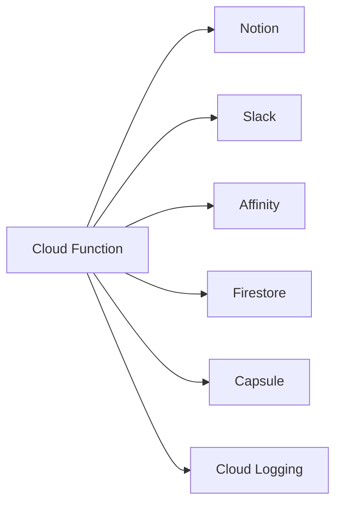

# People Onboarding Cloud Function

A Google Cloud Function that automates the synchronization of team member data between Notion and various integrated services (Slack, Affinity, Capsule).

## Overview

This cloud function is part of an automated onboarding system that:
- Processes new team member data from Notion
- Retrieves corresponding IDs from Slack and Affinity
- Updates the Notion database with the retrieved information
- Enqueues the data for Capsule integration
- Maintains a synchronized state in Firestore

## Architecture



## Code Structure

## Prerequisites

- Google Cloud Platform account
- Python 3.11
- Access to the following services:
  - Notion API
  - Slack API
  - Affinity API
  - Google Cloud Firestore
  - Google Cloud Logging

## Required Service Accounts

The function requires the following service account keys:
- `puppy-logging-key.json`: For Google Cloud Logging
- `puppy-executor-key.json`: For Firestore operations

## Environment Setup

1. Clone the repository
2. Install dependencies:
   ```bash
   pip install -r requirements.txt
   ```

## Configuration

The function uses the following configuration:

### Firestore Collections
- `Persons`: Stores team member information
- `NotionDatabases`: Stores Notion database configurations

### Required Notion Database
- `internal_team`: Contains team member information with the following properties:
  - Person (people)
  - Email
  - Slack ID
  - Affinity ID
  - Notion ID

## Deployment

### Manual Deployment

```bash
gcloud functions deploy people_onboarding \
  --runtime=python311 \
  --trigger-http \
  --region=europe-west1 \
  --project=digital-africa-rainbow \
  --entry-point=people_onboarding \
  --allow-unauthenticated \
  --service-account=puppy-sign@digital-africa-rainbow.iam.gserviceaccount.com
```

### Automated Deployment

Use the provided `deploy.sh` script:
```bash
./deploy.sh people_onboarding
```

## Function Details

### Input
The function accepts HTTP requests with the following structure:
```json
{
  "request_id": "optional-unique-identifier"
}
```

### Output
The function returns a JSON response with the following structure:
```json
{
  "status": "success",
  "processed": 5,
  "errors": 0
}
```

### Logging

The function uses structured logging with the following levels:
- INFO: General process information
- WARNING: Non-critical issues
- ERROR: Critical issues that need attention
- DEBUG: Detailed debugging information

Logs can be viewed in Google Cloud Logging with the following filter: 